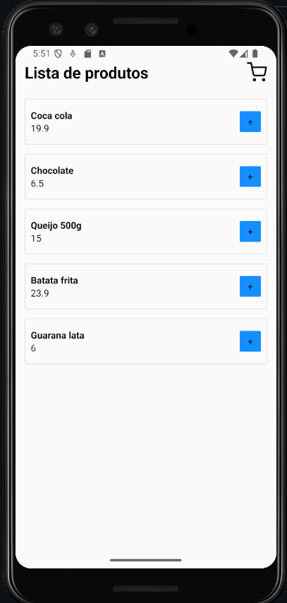
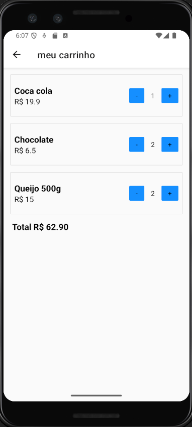

# 🛒 AppCarrinho

Aplicativo de carrinho de compras desenvolvido com **React Native** utilizando **Expo** no **Android Studio**.  
Este projeto foi criado com fins de **estudo**, como parte de um desafio do curso [Sujeito Programador](https://github.com/devfraga).

---

## 🚀 Tecnologias Utilizadas


---

## 📦 Bibliotecas Utilizadas

- [Axios](https://axios-http.com/) – requisições HTTP
- [Styled-Components](https://styled-components.com/) – estilização com CSS-in-JS
- [React Navigation](https://reactnavigation.org/) – navegação entre telas
- [React Native Screens](https://github.com/software-mansion/react-native-screens)
- [React Native Safe Area Context](https://github.com/th3rdwave/react-native-safe-area-context)
- [React Native Gesture Handler](https://docs.swmansion.com/react-native-gesture-handler/)
- [React Native Reanimated](https://docs.swmansion.com/react-native-reanimated/)

---

## 🧩 Extensões recomendadas (VS Code)

- **ESLint** – para padronização do código
- **Prettier** – formatação automática
- **React Native Tools** – execução e debug
- **Styled Components Snippets** – snippets para styled-components

---

## 🧑‍🏫 Desafio proposto por

[](https://github.com/devfraga)

---

## 📷 Imagens do App

- Tela de produtos  
  

- Carrinho com itens  
  

---

## 🛠️ Como rodar o projeto

Siga o passo a passo abaixo:

### 1. Clone o repositório

````bash
git clone https://github.com/GustavoLopesDev/AppCarrinho.git
cd AppCarrinho


## 🧪 Instalação e Execução

### ✅ Pré-requisitos

- [Node.js (v18+)](https://nodejs.org/)
- [Yarn](https://classic.yarnpkg.com/) ou npm
- [Git](https://git-scm.com/)
- [Android Studio](https://developer.android.com/studio) com emulador configurado
- [JDK 11+](https://www.oracle.com/java/technologies/javase/jdk11-archive-downloads.html)
- [React Native CLI](https://reactnative.dev/docs/environment-setup) (modo CLI, **não Expo**)

> ℹ️ Este projeto **não usa Expo**, é feito com React Native CLI.

## ⚙️ Configurando o Android

Abra o Android Studio e inicie um emulador Android.

Verifique se o dispositivo está conectado corretamente:

```bash
npx react-native doctor
````

---

## ▶️ Executando o app

Android: Escaneie o QR Code com o app Expo Go

Emulador: Execute pelo Android Studio com um AVD aberto

Web (opcional): Pressione w no terminal para abrir no navegador

---

## 🧩 Pré-requisitos

Node.js

Expo CLI

Git

Android Studio ou app Expo Go no celular

---
